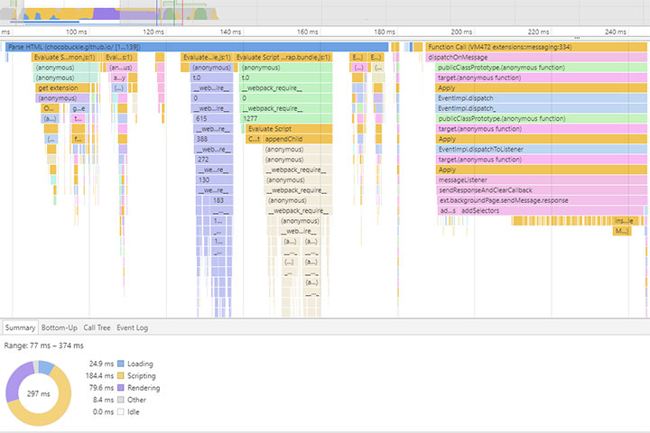

# Browser Rendering Optimisation

A browser rendering optimisation, submitted as a project for the Udacity Front-End Developer Nanodegree program.

## Introduction

Understanding lower-level concepts regarding how the browser works and interprets code enables a developer to produce highly performant applications. The project showcases my skills in identifying browser rendering bottlenecks and optimising the code accordingly for maximum user experience.

## Project Details

In this project I was given two tasks. First, to optimise 'main.js' so that 'index.html' renders with a consistent frame-rate of 60fps while scrolling, and second, to ensure that the time to resize the pizzas using the slider is less than 5ms. The site provided was purposefully designed badly and ignores numerous web development best practices, resulting in a poor user experience.

Please click [here](https://chocobuckle.github.io/rendering-optimisation-before/) to experience the slow, unoptimised version of the site as originally provided to me.

Below you can see a performance timeline profile of the unoptimised site, as captured in Chrome DevTools...

The red bar stretching across the top of the screen indicates long frames and severe 'jank' problems. Beneath this, the low green chart indicates that the page is creeping along at a very slow FPS rate. The next chart below that reveals large amounts of CPU resources being consumed by Javascript(yellow) and CSS(purple) processing. The flame chart represents a visualisation of the CPUT stack trace, and in this case is showing repeated forced synchronous layout calculations, as indicated by the red triangles in the top-right corner of each purple layout event. Finally, the summary pie chart at the bottom of the screen reveals that most of the browser's time is being spent processing performance instensive scripting and rendering. In regards to changing the pizza sizes with the slider, the response time is reported in the DevTools console as approximately 100 - 120ms, which is far too slow for what should be a simple operation.

The optimisations I have implemented to address all the above issues are as follows:

* Layout and style calculation times both depend on the number of elements effected, so one way to keep those times down is to reduce the number of elements that layout and style have to be calculated for. Following on from this logic, I created a 'createPizzas' function that calculates the width and height of the user's screen and then generates the minimum amount of pizzas necessary to fill the screen. Originally, the unoptimised page was generating 200 pizza elements no matter what device the page was being viewed on. With my implementation, the page now displays between 8 - 72 pizzas, catering for the smallest mobile devices and the largest desktops. This reduces the amount of elements unnecessarily generated by 64 - 96%.
* I throttled the 'updatePositions' function by using the requestAnimationFrame method so that the function is only called by scroll events 60 times per second and no more.
* Because there are only 5 unique phase values for each scroll event I pushed them to a 'phaseValues' array so I have references to their constant values. This eliminates unncessary calculations in the subsequent for loop.
* For the background pizza animation I used 'style.transform' instead of the original 'style.left' and 'basicLeft' calculations, which trigger page layout/reflow. 'Transform' does not trigger layout/reflow, and by using 'translate3d' I was able to promote the animation to the GPU, furthur relieving the CPU of work. I chose 'translate3d' over the newer 'will-change' property because the former currently has better browser support.
* Used 'document.createDocumentFragment' when appending multiple elements to the DOM. This means reflow/layout is triggered only once, instead of being triggered on each loop iteration.
* Replaced the 'innerHTML' properties with 'textContent' in the 'changeSliderLabel' function, as 'textContent' is faster.
* Replaced all 'querySelector' and 'querySelectorAll' selectors with appropriate 'getElementById' and 'getElementsByClassName' selectors, which are faster. In the case of "var items = document.querySelectorAll('.mover')" I refactored it to "window.items = document.getElementsByClassName('mover')" and relocated it to the 'loadPizzas' function, which is only called once on page load. Originally, the 'items' variable was being repeatedly declared and defined in the 'updatePositions' function, which was being called on every scroll event fired. Relocating the variable declaration and definition to the 'loadPizzas' function is a far more performant approach. I also moved the query to "#movingPizzas1" outside of its containing for loop, so its constant value is cached and not recalculated on each loop iteration.
* Deleted the needlessly performance intensive oldWidth/windowWidth/offsetWidth calculations in the provided 'changePizzaSlices' and 'determineDX' functions, which were causing layout thrashing when each calculation touched the DOM to retrieve the 'offsetWidth' property. Instead, I created a 'newWidth' variable and declared its percentage value depending on what value is passed into the switch statement via the function's 'size' argument. I then saved each DOM node with the class 'randomPizzaContainer' to an array, which allowed me to use the nodes in a for loop without repeatedly querying the DOM. Next, I updated each node's width property with the newWidth value returned from the switch statement previously mentioned. This approach minimises the calculations needed to be done by the browser to change the size of the pizza images, as there is no more query selecting inside the for loop and no more conversion back and forth between pixels and percentages. The net effect is a much quicker response time whenever the user adjusts the slider. Before optimisation, the time it took to resize the pizza images was approximately 100 - 120ms. After the above optimisations were implemented I reduced the response time to approximately 0.3 - 0.5ms.

Below is a screenshot of the DevTools performance timeline after all the above optimisations were implemented...

Here, a consistent 60FPS is achieved, 'jank' is gone, CPU calculations are minimal, the flame chart is no longer alerting forced synchronous layout events, and the summary pie chart shows that the browser is spending far less time scripting, rendering, and painting. The end result is a greatly improved user experience.

Please click [here](https://chocobuckle.github.io/rendering-optimisation-after/) to view the fully optimised page.

## Licence

The contents of this repository are covered under the [MIT License](https://github.com/chocobuckle/browser-rendering-optimisation/blob/master/LICENSE.txt).

